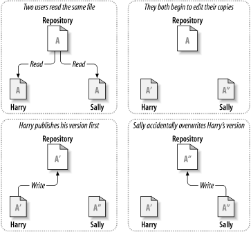

# 如何优雅的用svn合并（一）

---

# svn是什么？

SVN是Subversion的简称。

Subversion是一个自由/开源的版本控制系统。也就是说，在Subversion管理下，文件和目录可以超越时空。也就是Subversion允许你数据恢复到早期版本，或者是检查数据修改的历史。正因为如此，许多人将版本控制系统当作一种神奇的“时间机器”。

Subversion的版本库可以通过网络访问，从而使用户可以在不同的电脑上进行操作。从某种程度上来说，允许用户在各自的空间里修改和管理同一组数据可以促进团队协作。因为修改不再是单线进行，开发速度会更快。此外，由于所有的工作都已版本化，也就不必担心由于错误的更改而影响软件质量—如果出现不正确的更改，只要撤销那一次更改操作即可。

某些版本控制系统本身也是软件配置管理（SCM）系统，这种系统经过精巧的设计，专门用来管理源代码树，并且具备许多与软件开发有关的特性—比如，对编程语言的支持，或者提供程序构建工具。不过Subversion并不是这样的系统。它是一个通用系统，可以管理任何类型的文件集。对你来说，这些文件这可能是源程序—而对别人，则可能是一个货物清单或者是数字电影。

---

# Subversion的架构

---

# Subversion的组件

安装好的Subversion由几个部分组成，下面将简单的介绍一下这些组件。

`svn`

    命令行客户端程序。

`svnversion`

    此工具用来显示工作拷贝的状态（用术语来说，就是当前项目的修订版本）。

`svnlook`

    直接查看Subversion版本库的工具。

`svnadmin`

    建立、调整和修复Subversion版本库的工具。

---

`svndumpfilter`

    过滤Subversion版本库转储数据流的工具。

`mod_dav_svn`

    Apache HTTP服务器的一个插件，使版本库可以通过网络访问。

`svnserve`

    一个单独运行的服务器程序，可以作为守护进程或由SSH调用。
    
    这是另一种使版本库可以通过网络访问的方式。

`svnsync`

    一个通过网络增量镜像版本库的程序。

---

# Subversion的核心部分

Subversion是一个“集中式”的信息共享系统。版本库是Subversion的核心部分，是数据的中央仓库。版本库以典型的文件和目录结构形式文件系统树来保存信息。任意数量的客户端连接到Subversion版本库，读取、修改这些文件。客户端通过写数据将信息分享给其他人，通过读取数据获取别人共享的信息。

## 一个典型的客户/服务器系统: 

---

# Subversion的核心任务

* 实现协作编辑

* 数据共享

---

# 文件共享的问题

所有的版本控制系统都需要解决这样一个基础问题：怎样让系统允许用户共享信息，而不会让他们因意外而互相干扰？版本库里意外覆盖别人的更改非常的容易。

考虑下图的情景，我们有两个共同工作者，Harry和Sally，他们想同时编辑版本库里的同一个文件，如果首先Harry保存它的修改，过了一会，Sally可能凑巧用自己的版本覆盖了这些文件，Harry的更改不会永远消失（因为系统记录了每次修改），但Harry所有的修改不会出现在Sally新版本的文件中，所以Harry的工作还是丢失了—至少是从最新的版本中丢失了—而且可能是意外的，这就是我们要明确避免的情况！

---

# 文件共享的方案

* 锁定-修改-解锁 方案

* 拷贝-修改-合并 方案

---

# 锁定-修改-解锁 方案

许多版本控制系统使用锁定-修改-解锁机制解决这种问题，在这样的模型里，在一个时间段里版本库的一个文件只允许被一个人修改。首先在修改之前，Harry要“锁定”住这个文件，锁定很像是从图书馆借一本书，如果Harry锁住这个文件，Sally不能做任何修改，如果Sally想请求得到一个锁，版本库会拒绝这个请求。在Harry结束编辑并且放开这个锁之前，她只可以阅读文件。Harry解锁后，就要换班了，Sally得到自己的轮换位置，锁定并且开始编辑这个文件。

下图描述了这样的解决方案:

---

锁定-修改-解锁模型有一点问题就是限制太多，经常会成为用户的障碍：

* 锁定可能导致管理问题。有时候Harry会锁住文件然后忘了此事，这就是说Sally一直等待解锁来编辑这些文件，她在这里僵住了。然后Harry去旅行了，现在Sally只好去找管理员放开锁，这种情况会导致不必要的耽搁和时间浪费。

* 锁定可能导致不必要的线性化开发。如果Harry编辑一个文件的开始，Sally想编辑同一个文件的结尾，这种修改不会冲突，设想修改可以正确的合并到一起，他们可以轻松的并行工作而没有太多的坏处，没有必要让他们轮流工作。

* 锁定可能导致错误的安全状态。假设Harry锁定和编辑一个文件A，同时Sally锁定并编辑文件B，如果A和B互相依赖，这种变化是必须同时作的，这样A和B不能正确的工作了，锁定机制对防止此类问题将无能为力—从而产生了一种处于安全状态的假相。很容易想象Harry和Sally都以为自己锁住了文件，而且从一个安全，孤立的情况开始工作，因而没有尽早发现他们不匹配的修改。锁定经常成为真正交流的替代品

---

# 拷贝-修改-合并 方案

Subversion，CVS和一些版本控制系统使用拷贝-修改-合并模型，在这种模型里，每一个客户联系项目版本库建立一个个人工作拷贝—版本库中文件和目录的本地映射。用户并行工作，修改各自的工作拷贝，最终，各个私有的拷贝合并在一起，成为最终的版本，这种系统通常可以辅助合并操作，但是最终要靠人工去确定正误。

这是一个例子，Harry和Sally为同一个项目各自建立了一个工作拷贝，工作是并行的，修改了同一个文件A，Sally首先保存修改到版本库，当Harry想去提交修改的时候，版本库提示文件A已经过期，换句话说，A在他上次更新之后已经更改了，所以当他通过客户端请求合并版本库和他的工作拷贝之后，碰巧Sally的修改和他的不冲突，所以一旦他把所有的修改集成到一起，他可以将工作拷贝保存到版本库。

下面两张图展示了这一过程。

---

拷贝-修改-合并 方案-图1:

---

拷贝-修改-合并 方案-图2:

---

但是如果Sally和Harry的修改交迭了该怎么办？这种情况叫做冲突，这通常不是个大问题，当Harry告诉他的客户端去合并版本库的最新修改到自己的工作拷贝时，他的文件A就会处于冲突状态：他可以看到一对冲突的修改集，并手工的选择保留一组修改。需要注意的是软件不能自动的解决冲突，只有人可以理解并作出智能的选择，一旦Harry手工的解决了冲突—也许需要与Sally讨论—它可以安全的把合并的文件保存到版本库。

拷贝-修改-合并模型感觉有一点混乱，但在实践中，通常运行的很平稳，用户可以并行的工作，不必等待别人，当工作在同一个文件上时，也很少会有交迭发生，冲突并不频繁，处理冲突的时间远比等待解锁花费的时间少。

最后，一切都要归结到一条重要的因素：用户交流。当用户交流贫乏，语法和语义的冲突就会增加，没有系统可以强制用户完美的交流，没有系统可以检测语义上的冲突，所以没有任何证据能够承诺锁定系统可以防止冲突，实践中，锁定除了约束了生产力，并没有做什么事。

---

# 什么时候锁定是必需的

锁定-修改-解锁模型被认为不利于协作，但有时候锁定会更好。

拷贝-修改-合并模型假定文件是可以根据上下文合并的：就是版本库的文件主要是以行为基础的文本文件（例如程序源代码）。但对于二进制格式，例如艺术品或声音，在这种情况下，十分有必要让用户轮流修改文件，如果没有线性的访问，有些人的许多工作就最终要被放弃。

---

# 工作拷贝怎样跟踪版本库

对于工作拷贝的每一个文件，Subversion在管理区域.svn/记录两项关键的信息：

* 工作文件所作为基准的修订版本（叫做文件的工作修订版本）

* 一个本地拷贝最后更新的时间戳。

给定这些信息，通过与版本库通讯，Subversion可以告诉我们工作文件是处于下面四种状态的哪一种：

---

# 工作文件的四种状态

### 未修改且是当前的

文件在工作目录里没有修改，在工作修订版本之后没有修改提交到版本库。svn commit操作不做任何事情，svn update不做任何事情。

### 本地已修改且是当前的

在工作目录已经修改，从基本修订版本之后没有修改提交到版本库。本地修改没有提交，因此svn commit会成功提交，svn update不做任何事情。

### 未修改且不是当前的了

这个文件在工作目录没有修改，但在版本库中已经修改了。这个文件最终将更新到最新版本，成为当时的公共修订版本。svn commit不做任何事情，svn update将会取得最新的版本到工作拷贝。

### 本地已修改且不是最新的

这个文件在工作目录和版本库都得到修改。一个svn commit将会失败，这个文件必须首先更新，svn update命令会合并公共和本地修改，如果Subversion不可以自动完成，将会让用户解决冲突。

---

# 更新和提交是分开的

Subversion有一个基本原则就是一个“推”动作不会导致“拉”，反之亦然，因为你准备好了提交你的修改并不意味着你已经准备好了从其他人那里接受修改。如果你的新的修改还在进行，svn update将会优雅的合并版本库的修改到你的工作拷贝，而不会强迫将修改发布。

这个规则的主要副作用就是工作拷贝需要记录额外的信息来追踪混合修订版本，并且也需要能容忍这种混合，当目录本身也是版本化的时候情况更加复杂。

举个例子，假定你有一个工作拷贝，修订版本号是10。你修改了foo.html，然后执行svn commit，在版本库里创建了修订版本15。当成功提交之后，许多用户希望工作拷贝完全变成修订版本15，但是事实并非如此。修订版本从10到15会发生任何修改，可是客户端在运行svn update之前不知道版本库发生了怎样的改变，svn commit不会拖出任何新的修改。另一方面，如果svn commit会自动下载最新的修改，可以使得整个工作拷贝成为修订版本15—但是，那样我们会打破“push”和“pull”完全分开的原则。因此，Subversion客户端最安全的方式是标记一个文件—foo.html—为修订版本15，工作拷贝余下的部分还是修订版本10。只有运行svn update才会下载最新的修改，整个工作拷贝被标记为修订版本15。

---

# 重要的建议说三遍

* 提交之前先更新，有冲突要协商解决

* 提交之前先更新，有冲突要协商解决

* 提交之前先更新，有冲突要协商解决

---

# 基本的工作周期

Subversion有许多特性、选项和华而不实的高级功能，但日常的工作中你只使用其中的一小部分。

典型的工作周期是这样的：

* 更新你的工作拷贝

    * svn update

* 做出修改

    * svn add
    * svn delete
    * svn copy
    * svn move

---

* 检验修改

    * svn status
    * svn diff

* 可能会取消一些修改

    * svn revert

---

* 解决冲突（合并别人的修改）

    * svn update
    * svn resolved

* 提交你的修改

    * svn commit

---

# 谢谢观赏，未完待续，有缘再见
